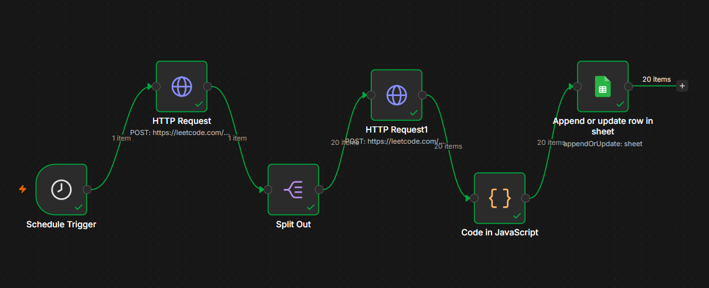

# 🔁 LeetCode Progress Tracker Automation

An automated workflow that tracks daily LeetCode progress and logs it into Google Sheets — with zero manual effort. Built using n8n, LeetCode's GraphQL API, and a custom spaced-repetition revision system.

## 📌 Overview

As part of my placement preparation, I solve LeetCode problems daily. Manually tracking solved questions, their difficulty, pattern, and revision schedule in Excel was time-consuming. This project automates the entire process.

Every day, the workflow:
1. Fetches recently solved LeetCode questions
2. Extracts difficulty level and topic tags for each question
3. Maps questions to DSA patterns (Two Pointers, Sliding Window, DP, etc.)
4. Calculates spaced-repetition revision dates (Day 1 / Day 7 / Day 21)
5. Logs everything into Google Sheets — automatically, with no duplicates

### n8n Workflow Pipeline

## ⚙️ How It Works
Schedule Trigger (Daily)
    ↓
HTTP Request → LeetCode GraphQL API (fetch recent submissions)
    ↓
Split Out → break submissions into individual items
    ↓
HTTP Request → fetch difficulty + topic tags per question
    ↓
Code Node (JavaScript) → map patterns + calculate revision dates
    ↓
Google Sheets → Append or Update Row (prevents duplicates)

## 🛠️ Tech Stack

- **n8n** – workflow automation platform
- **LeetCode GraphQL API** – to fetch submission and question data
- **JavaScript** – pattern mapping and date calculation logic
- **Google Sheets API** – data storage and tracking

## ✨ Features

- **Fully automated** — runs daily on a schedule, no manual input needed
- **Duplicate-safe** — uses `Append or Update Row` matched on question slug
- **Pattern classification** — auto-tags each question into DSA patterns
- **Spaced repetition** — auto-calculates Day 1 / Day 7 / Day 21 revision reminders
- **Zero-cost** — built entirely on free tiers (n8n Cloud + Google Sheets)

## 📊 Google Sheets Output

## 🚀 Setup

1. Import `workflow.json` into your n8n instance
2. Connect your Google Sheets account (OAuth)
3. Create a Google Sheet with these headers:
   `Title | TitleSlug | Pattern | Difficulty | DateSolved | Day1 | Day1_Done | Day7 | Day7_Done | Day21 | Day21_Done`
4. Replace `username` in the HTTP Request node with your LeetCode username
5. Set your preferred schedule time in the Schedule Trigger node
6. Publish the workflow

## 💡 Why I Built This

Consistent DSA practice matters for placements, but knowing *what* to revise and *when* is just as important. This project removes the manual tracking overhead so I can focus purely on problem-solving, while the system handles pattern classification and revision scheduling automatically.

## 👤 Author

**Bharat Goswami**  
B.Tech CSE (AI/ML), Career Point University  
[LinkedIn](https://linkedin.com/in/bharatgoswami19)
